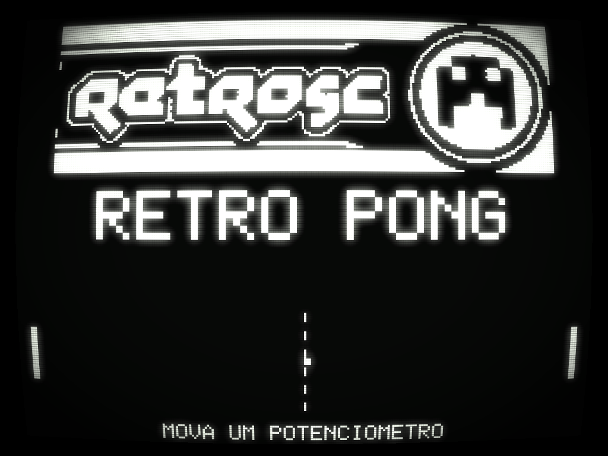
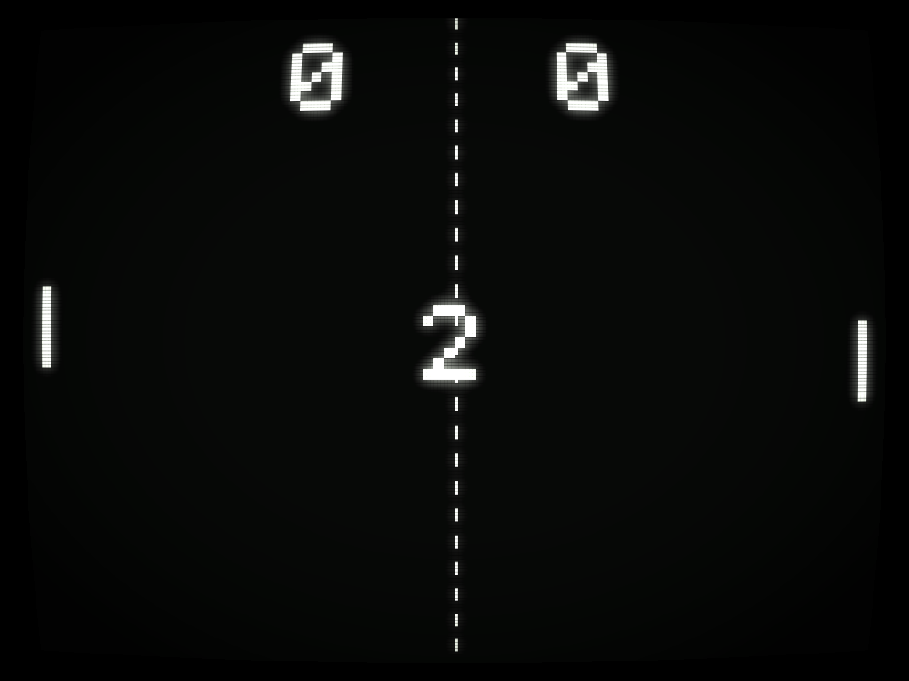
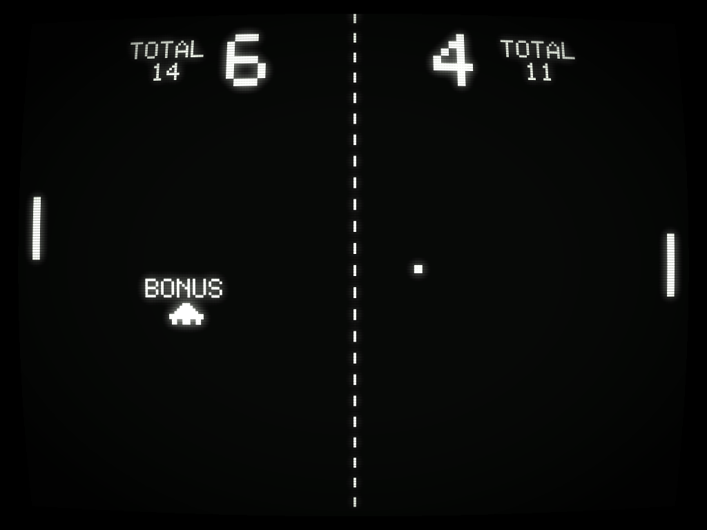
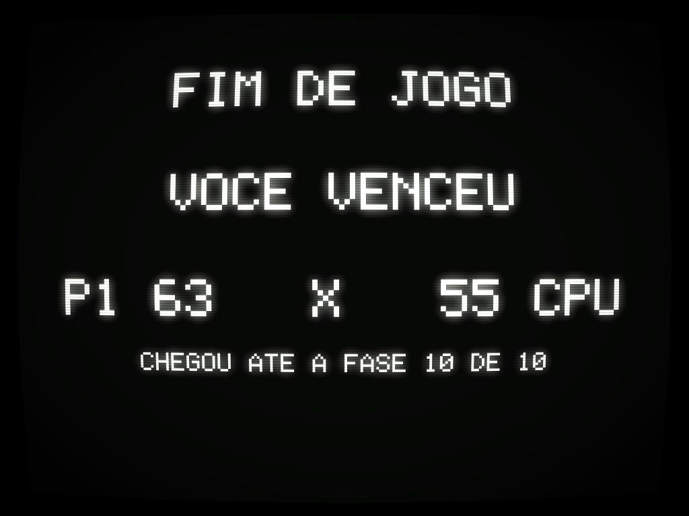
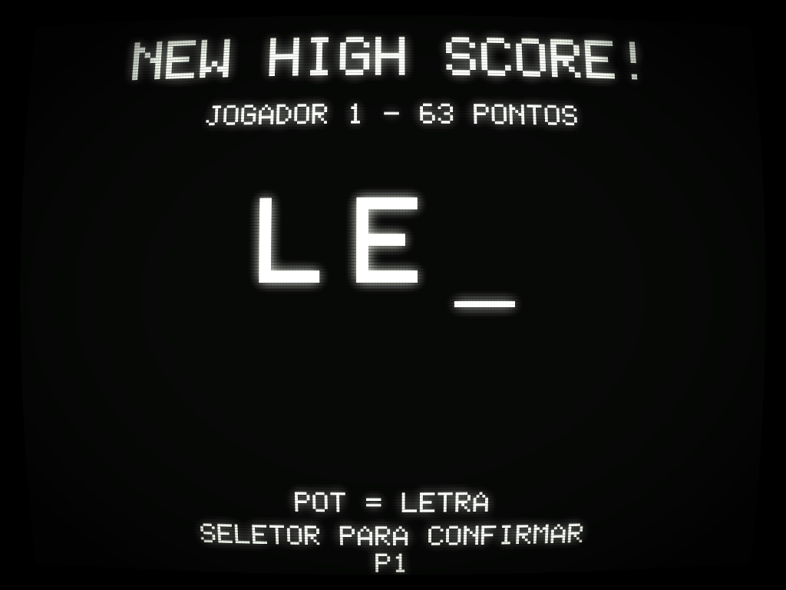
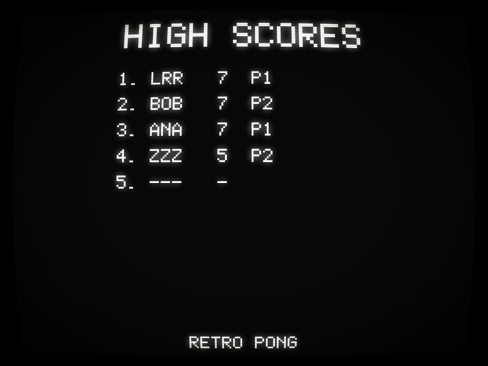

# RetroSC Pong — Raspberry Pi Pico (RP2040)

Pong clássico de 2 jogadores em um Raspberry Pi Pico, com saída de **vídeo
composto** (NTSC 1-bit gerado por PIO) e **áudio PWM**. Foi feito para uma
máquina arcade do evento [**RetroSC**](https://retrosc.org/).


## Recursos

- Vídeo composto NTSC 256×192, 1-bit, ~60 Hz, gerado inteiramente em PIO + DMA
  (CPU livre para o jogo).
- 2 raquetes controladas por **potenciômetros 10 kΩ** (ADC do Pico).
- **Attract screen** com logo da RetroSC + demo automático (AI vs AI).
- Pontuação para vencer configurável (`WIN_SCORE` em `src/config.h`, padrão 7).
- **High scores persistentes** na flash do RP2040 com **iniciais de 3 letras**
  estilo arcade — o vencedor usa o potenciômetro para escolher cada letra
  e o botão START para confirmar.
- Áudio com os 3 sons clássicos do Pong (raquete, parede, ponto) em PWM
  filtrado.
- Botão **START** opcional (também sai do attract jiggling qualquer
  potenciômetro).

## Estrutura do repositório

```
pong-rp2040/
├── CMakeLists.txt
├── pico_sdk_import.cmake
├── README.md
├── LICENSE
├── docs/
│   ├── schematic.md     <-- esquemático ASCII completo
│   ├── pinout.md        <-- pinout do Pico
│   ├── bom.md           <-- lista de materiais
│   └── images/          <-- logo, mascote, fotos do gabinete
├── src/
│   ├── main.c
│   ├── config.h         <-- constantes do projeto (pinos, dimensões, etc.)
│   ├── ntsc.{c,h,pio}   <-- driver de vídeo composto
│   ├── gfx.{c,h}        <-- desenho no framebuffer
│   ├── font.{c,h}       <-- fonte 5x7
│   ├── input.{c,h}      <-- ADC dos pots + botão
│   ├── audio.{c,h}      <-- PWM de áudio
│   ├── highscores.{c,h} <-- persistência na flash
│   ├── game.{c,h}       <-- máquina de estados e física
│   └── assets.{c,h}     <-- bitmaps embutidos
└── tools/
    └── png_to_c.py      <-- conversor PNG → C array
```

## Hardware

Veja os arquivos em [docs/](docs/) para detalhes:

- [docs/schematic.md](docs/schematic.md) — esquemático completo
- [docs/pinout.md](docs/pinout.md) — mapa dos GPIOs do Pico
- [docs/bom.md](docs/bom.md) — lista de materiais e custo

Resumo do hardware:

| Bloco                  | Pinos do Pico  | Componentes externos                 |
| ---------------------- | -------------- | ------------------------------------ |
| Vídeo composto (RCA)   | GP16 (sync), GP17 (video) | 1× 470 Ω, 1× 220 Ω          |
| Áudio (alto-falante)   | GP18 (PWM)     | 1 kΩ + 100 nF (filtro RC) + amp PAM8403 |
| Botão START            | GP22           | push button para GND                 |
| Potenciômetro P1       | GP26 (ADC0)    | pot 10 kΩ linear + 100 nF para GND   |
| Potenciômetro P2       | GP27 (ADC1)    | pot 10 kΩ linear + 100 nF para GND   |

## Como compilar

### 1. Instalar o Pico SDK

**Recomendado (Windows):** baixe o [Raspberry Pi Pico Windows Installer](https://github.com/raspberrypi/pico-setup-windows/releases),
que instala toolchain (ARM GCC), CMake, Ninja, Python e o Pico SDK de uma
vez.

**Manual (qualquer SO):**

```bash
git clone --depth 1 https://github.com/raspberrypi/pico-sdk.git
cd pico-sdk
git submodule update --init
export PICO_SDK_PATH=$(pwd)
```

Instale também:

- ARM GCC (`gcc-arm-none-eabi`)
- CMake ≥ 3.13
- Ninja ou Make

### 2. Build

```bash
git clone https://github.com/lrrosa/pong-retrosc-rp2040.git
cd pong-retrosc-rp2040
mkdir build && cd build
cmake -G "Ninja" ..   # ou simplesmente: cmake ..
ninja                 # ou: make -j
```

Resultado: `build/pong-rp2040.uf2`.

### 3. Gravar no Pico

1. Segure o botão **BOOTSEL** do Pico enquanto conecta o USB.
2. O Pico aparece como pendrive (`RPI-RP2`).
3. Arraste `pong-rp2040.uf2` para dentro do pendrive.
4. O Pico reinicia automaticamente rodando o jogo.

## Simulador (Python, sem hardware)

Para iterar em layouts e gameplay sem flashear o Pico, há um simulador que
roda a mesma lógica em Python e carrega os MESMOS bitmaps/fonte do código C:

```bash
pip install pygame
python tools/sim.py
```

Janela 768×576 (framebuffer 256×192 × 3). Controles:

- **Mouse Y na metade esquerda** → raquete P1
- **Mouse Y na metade direita** → raquete P2
- **Espaço** → botão START
- **R** → zera high scores (só em RAM, não toca a flash do Pico)
- **Q** ou **ESC** → sair

Pré-visualizações com efeito CRT (como deve ficar numa TV de tubo —
scanlines, glow de fósforo, vignette e curvatura):

| Attract | Countdown | Play |
| :---: | :---: | :---: |
|  |  |  |

| Game Over | Enter Initials | High Scores |
| :---: | :---: | :---: |
|  |  |  |

Renderizações "raw" (sem CRT, só o framebuffer escalado) ficam em
`docs/images/sim_*.png`.

> **Limitação:** o simulador não reproduz a fidelidade do sinal NTSC nem
> o timing exato do PIO/DMA. Use para validar UX e visual; o teste final
> do vídeo só com a TV real.

### CRT preview

Para aplicar o efeito CRT (scanlines + bloom + fósforo + vignette +
curvatura) em qualquer PNG do framebuffer:

```bash
pip install pillow numpy
python tools/crt_preview.py docs/images/sim_attract.png        # gera crt_sim_attract.png
python tools/crt_preview.py --all                              # regenera todos os crt_*.png
```

Os parâmetros (intensidade do bloom, dos scanlines, cor do fósforo) estão
no topo de `crt_effect()` em [tools/crt_preview.py](tools/crt_preview.py)
e são bons pontos de partida; mexa neles pra ajustar pra TV verde, âmbar,
ou ajustar o "estado" do tubo.

## Como jogar

- **Liga**: conecte alimentação (USB ou fonte 5 V).
- **Sair do attract**: mexa qualquer potenciômetro **ou** aperte START.
- **Jogar**: rode os potenciômetros para mover as raquetes (esquerda = P1,
  direita = P2). Primeiro a marcar 7 pontos vence.
- **Iniciais**: se o vencedor entrar no top 5, ele insere 3 letras estilo
  arcade — girar o pot rola pelo alfabeto A–Z, apertar START confirma a
  letra atual e passa para a próxima.
- **High scores**: depois das iniciais (ou direto, se não entrou no top),
  a tabela aparece por 10 s antes de voltar ao attract.

## Customização

Tudo importante está em [`src/config.h`](src/config.h):

- `WIN_SCORE` — pontos para vencer
- `BALL_SPEED_*` — física da bola
- `PADDLE_W`, `PADDLE_H`, `BALL_SIZE` — visual
- Pinos GPIO

Para trocar o logo do attract:

```bash
python tools/png_to_c.py docs/images/seu_logo.png   retrosc_logo   0   0   threshold > tools/_logo.inc
python tools/png_to_c.py docs/images/seu_mascote.png retrosc_mascote 80 80 threshold > tools/_mascote.inc
# Substituir os arrays correspondentes em src/assets.c
```

Modo `threshold` (corte fixo em 128) é melhor para arte com contornos
definidos (logos, ícones). Modo `dither` (Floyd-Steinberg) é melhor para
fotos com gradientes — mas em 60 Hz num CRT, o padrão de dithering pode
ficar tremido. Para o evento, prefira `threshold`.

Veja `docs/images/preview_logo_1bit.png` e `preview_mascote_1bit.png` para
saber como ficou a versão 1-bit.

## Limitações conhecidas

- **NTSC monocromático**: sem cor. Em TVs PAL-M brasileiras, a maioria
  aceita o sinal sem problema (mostra em preto e branco). Se sua TV não
  aceita, talvez precise de uma TV CRT com entrada AV "real" ou um
  conversor.
- **Timing do PIO** está calculado para `clk_sys = 125 MHz`. Se você
  alterar o clock, ajuste `clkdiv` em `src/ntsc.c` proporcionalmente.
- **High scores sem iniciais**: o MVP grava apenas o número de pontos e o
  lado (P1/P2). Implementar entrada de iniciais é uma melhoria futura
  (usar o pot para selecionar letras + START para confirmar).

## Créditos e referências

- A abordagem de gerar NTSC com duas PIOs (sync + dados) + DMA é inspirada
  no trabalho de [@brucland](https://github.com/brucland/RP2040/tree/main/PIO/NTSC_1_bit).
  Este projeto é uma implementação independente (não copia o código), mas a
  análise daquele repositório foi essencial para definir o timing.
- Pong original: Allan Alcorn, Atari (1972).
- Logo e mascote da RetroSC: cortesia do evento [RetroSC](https://retrosc.org/).

## Licença

Código sob [MIT](LICENSE). Marcas e arte do evento RetroSC (logo, mascote)
permanecem propriedade do evento — ver nota no `LICENSE`.
