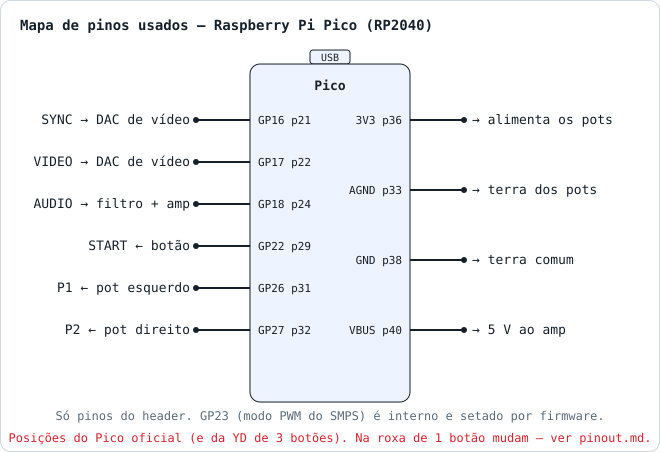
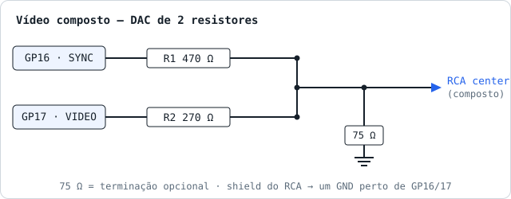
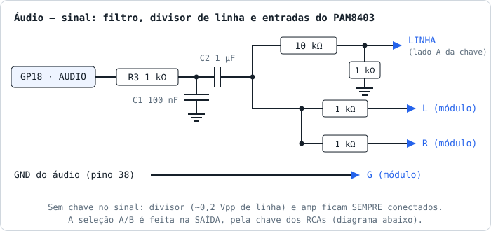
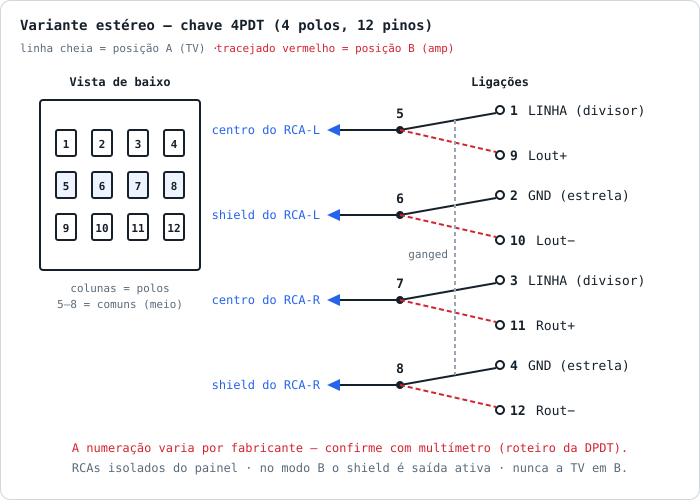
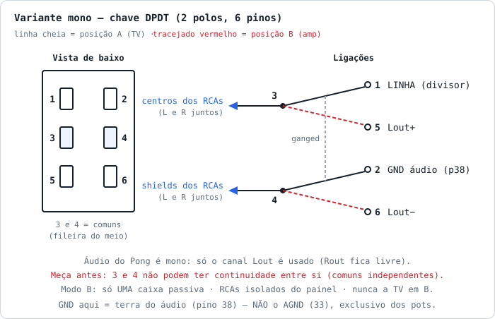
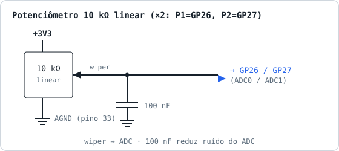
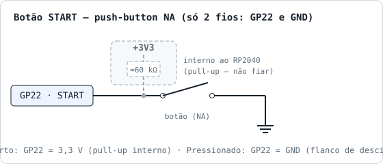

# Esquemático

Diagramas por **bloco funcional** (SVG). Cada bloco é independente; o mapa
abaixo mostra apenas quais pinos do Pico vão para cada um. Para uma PCB,
reconstrua em KiCad/EasyEDA a partir destes valores.



## DAC de vídeo composto (2 resistores)



Combina os 2 pinos GPIO num sinal de 3 níveis lido pela TV:

| GP16 (SYNC) | GP17 (VIDEO) | Tensão na TV (75 Ω carga) | Significado          |
| :---------: | :----------: | :-----------------------: | -------------------- |
| 0           | 0            | 0,00 V                    | Sync tip             |
| 1           | 0            | ~0,37 V                   | Black (blanking)     |
| 1           | 1            | ~1,00 V                   | White                |
| 0           | 1            | (não usado)               | -                    |

Cálculo (Thevenin, 3,3 V, R1=470, R2=270, term=75):

```
G = 1/470 + 1/270 + 1/75 = 0,01916 S
V_black = (3.3/470) / G = 0,366 V
V_white = (3.3/470 + 3.3/270) / G = 1,004 V
```

> **Por que 270 Ω (e não 220 Ω)?** Com 220 Ω o branco fica em ~1,10 V — um
> pouco "quente" acima do 1,00 V padrão. Com 270 Ω o branco cai exatamente em
> ~1,00 V; **testado na TV real, a imagem fica visivelmente melhor**. (1 kΩ +
> 470 Ω também funciona, mas o branco despenca para ~0,63 V — imagem escura.)

### Impedância de saída do GPIO (drive strength)

O cálculo acima assume uma fonte ideal de 3,3 V. Na prática, cada pino GPIO do
RP2040 tem uma impedância de saída em série que se soma a R1/R2 e **abaixa**
os níveis (o branco fica abaixo do calculado). No default (drive de 4 mA) essa
impedância é de ~40–50 Ω; o projeto [obstruse/pico-composite8](https://github.com/obstruse/pico-composite8)
mediu ~40 Ω e teve que compensar nos resistores do seu DAC R2R de 8 bits.

No nosso DAC de 3 níveis isso é menos crítico (a TV tolera bem a faixa), mas
em `src/ntsc.c` configuramos os pinos de vídeo para **drive de 12 mA com slew
rate rápido**, o que reduz a impedância de saída, aproxima os níveis do
calculado e deixa preto/branco mais consistentes:

```c
gpio_set_drive_strength(NTSC_SYNC_PIN,  GPIO_DRIVE_STRENGTH_12MA);
gpio_set_drive_strength(NTSC_VIDEO_PIN, GPIO_DRIVE_STRENGTH_12MA);
gpio_set_slew_rate(NTSC_SYNC_PIN,  GPIO_SLEW_RATE_FAST);
gpio_set_slew_rate(NTSC_VIDEO_PIN, GPIO_SLEW_RATE_FAST);
```

> O próprio **R2 = 270 Ω saiu dessa calibração**: partimos de 220 Ω (branco
> teórico 1,10 V) e o teste na TV real mostrou imagem melhor com 270 Ω
> (branco ~1,00 V). Se quiser refinar mais, meça o branco com a TV conectada
> (carga de 75 Ω) e ajuste R2 até ~1,0 V.

O datasheet do RP2040 (seção 5.5.3.5) confirma essa abordagem: "quanto maior o
drive strength, mais próxima a tensão de saída fica de IOVDD para uma dada
corrente". Dois números úteis dele para este DAC:

- **Margem de corrente:** o limite do banco de IO é `I_IOVDD_MAX = 50 mA`. No
  pior caso (branco, os dois pinos em '1') o DAC puxa ~8,5 mA no pino de vídeo
  (270 Ω) + ~5 mA no de sync (470 Ω) = **~13 mA**. Folga enorme; sem risco. O
  `VOH` mínimo a 3,3 V é 2,62 V já na corrente nominal, e puxamos bem menos.
- **Decoupling de IOVDD:** o datasheet pede 100 nF perto de cada pino IOVDD.
  Na **placa Pico isso já está pronto** — só importa se você fizer uma PCB com
  o **RP2040 cru** (sem módulo), onde esses capacitores precisam ser incluídos.

## Áudio (PWM filtrado + amplificador)



- **R3 = 1 kΩ + C1 = 100 nF**: filtro RC passa-baixa (fc ≈ 1,6 kHz). Remove
  componentes do PWM, deixando passar os beeps do Pong (até ~500 Hz).
- **C2 = 1 µF**: acoplamento DC. **Não é opcional** se o módulo tiver chave
  liga/desliga no pot de volume: com o amp desligado e sem o C2, o PWM do GP18
  injeta corrente pelo diodo de proteção da entrada do chip ("back-powering")
  e o ruído resultante no terra chega a disparar a detecção de movimento dos
  potenciômetros (sintoma real: o jogo "pulava" a tela de attract sozinho).
- **2× 1 kΩ depois do C2, um para cada entrada (L e R)**: alimenta os dois
  canais do PAM8403 com o sinal mono e isola uma entrada da outra. A carga
  resultante (~5,5 kΩ) causa perda de ~15% no nível — irrelevante. Nenhuma
  entrada fica aberta (entrada flutuando = chiado no canal sem uso).

Amplificador sugerido: **PAM8403** (módulo barato, 3 W). Saída direta para
alto-falante de 4–8 Ω (3 W). Ajustar potenciômetro de volume do módulo, ou
adicionar um trimpot de 10 kΩ entre o filtro e a entrada do amp. **Deixe o
amp sempre alimentado** — não use a chave do pot de volume para cortar o 5 V
(ver nota do C2 acima).

> ⚠️ **As saídas de alto-falante do PAM8403 NÃO têm terra (BTL).** Cada canal
> é uma ponte com os dois terminais ativos; o "−" da saída **não é GND**.
> **Nunca** ligue Lout−/Rout− ao terra (do vídeo ou qualquer outro), **nunca**
> junte Lout− com Rout−, e não conecte as saídas a fone/linha de outro
> aparelho — isso curto-circuita uma saída chaveada e pode queimar o chip.
> Cada alto-falante liga apenas no par +/− do seu canal, com par trançado
> próprio. Com um alto-falante só, use um canal e deixe o outro par
> desconectado (saída sem carga é seguro). Os únicos terras verdadeiros do
> módulo são **power −** e o **G** da entrada — esses sim seguem a estrela.

Alternativa minimalista: alto-falante de PC (8 Ω) direto via capacitor de
acoplamento de 10 µF — volume baixo, mas funciona.

### Chave A/B — RCAs de áudio: linha p/ TV ou saídas do amp

Duas variantes, mesma ideia: **4PDT** (abaixo, RCAs independentes) ou
**DPDT/mono** (mais simples — veja no fim da seção; é a suficiente para o
Pong, cujo áudio é mono).

#### Variante estéreo — chave 4PDT (4 polos)



O gabinete tem **dois RCA fêmea de áudio**. Uma única chave **4PDT** (4 polos
× 2 posições, mini toggle ou deslizante) escolhe o que eles carregam. **Não há
chave no caminho de sinal**: o divisor de linha (10 kΩ + 1 kΩ, ~0,2 Vpp) e as
entradas do amp ficam sempre conectados — por isso as entradas do PAM8403
nunca flutuam e não é preciso resistor de referência extra.

| Polo | Comum (→ RCA)   | Lado A (TV)        | Lado B (amp) |
| :--: | ---------------- | ------------------ | ------------ |
| 1    | RCA-L · centro   | LINHA (divisor)    | Lout+        |
| 2    | RCA-L · shield   | GND (estrela)      | Lout−        |
| 3    | RCA-R · centro   | LINHA (divisor)    | Rout+        |
| 4    | RCA-R · shield   | GND (estrela)      | Rout−        |

- **Modo A — TV:** os RCAs carregam **nível de linha** referenciado ao GND —
  plugue direto na entrada de áudio da TV. Saída de linha é referenciada ao
  terra **por projeto**, então o terra comum interno da TV deixa de ser
  problema. Volume baixo? Troque o 10 kΩ do divisor por 4,7 kΩ (~0,45 Vpp).
  Passe o cabo de áudio junto do de vídeo para minimizar o laço de terra.
- **Modo B — amp:** os RCAs carregam as **saídas BTL** do PAM8403 (+ no
  centro, − no shield) para **caixas passivas** plugadas neles.
- No modo A o amp amplifica "para o nada" (saída aberta é seguro em
  classe-D); se preferir, desligue-o no interruptor do volume — o C2 doma o
  back-powering.

> ⚠️ **Dois cuidados obrigatórios:** (1) os **RCAs devem ser isolados do
> painel** se ele for metálico — no modo B o shield é Lout−/Rout− (saída
> ativa), e encostar num chassi aterrado recria o curto BTL. (2) **No modo B,
> nunca plugue o cabo da TV nos RCAs** — dentro da TV os shields de todos os
> RCAs são o mesmo terra e o curto se fecha "por dentro" (foi um sintoma real:
> perda total de sincronismo com o volume ligado; o multímetro na bancada não
> enxerga porque a junção só existe com os cabos plugados). **Etiquete a
> chave**: som na TV é só no modo A.

#### Variante mono — chave DPDT (2 polos)



**O áudio do Pong é mono** (um único beep no GP18), então estéreo não agrega
nada — dá para fazer o mesmo A/B com apenas **2 polos**, usando uma **DPDT**
(mais fácil de achar; uma chave seletora de tensão de 6 pinos serve). Ligue os
**dois RCAs em paralelo** e comute-os juntos.

Numeração típica da DPDT de 6 pinos (vista de baixo, 2 fileiras de 3 — a
**fileira do meio são os comuns**):

| Pino          | Liga em                             | Quando        |
| :-----------: | ----------------------------------- | ------------- |
| **3** (comum) | **centros** dos RCAs (L e R juntos) | sempre        |
| 1             | LINHA (saída do divisor)            | posição **A** |
| 5             | Lout+ do PAM8403                    | posição **B** |
| **4** (comum) | **shields** dos RCAs (L e R juntos) | sempre        |
| 2             | GND (estrela do Pico)               | posição **A** |
| 6             | Lout− do PAM8403                    | posição **B** |

- Só o canal **Lout** é usado; **Rout fica livre** (não ligue em nada).
- **Modo A:** os dois RCAs mandam o mesmo mono para a TV — plugue em L, em R,
  ou nos dois.
- **Modo B:** plugue **apenas UMA caixa passiva**. Duas em paralelo caem para
  ~2 Ω e forçam o amp.
- Valem os **mesmos dois cuidados** da 4PDT (RCAs isolados do painel; nunca a
  TV no modo B).

> ⚠️ **"6 pinos" ≠ "6 polos".** Uma chave com 6 terminais em 2 fileiras de 3 é
> uma **DPDT**: 2 polos × (1 comum + 2 posições). Um 6PDT de verdade teria 18
> terminais. Corrente não é problema: 3 A / 250 V é folga enorme para sinal de
> áudio.
>
> **Meça antes de soldar** (a numeração acima é a típica, mas confirme na sua):
> 1. **Comuns:** com a chave numa posição, o comum é o pino que dá continuidade
>    com **um** dos vizinhos e, ao virar a alavanca, passa a dar com **o outro**
>    (normalmente a fileira do meio: 3 e 4).
> 2. **Independência:** os dois comuns (3 e 4) **não podem ter continuidade
>    entre si** em nenhuma posição — chaves seletoras de tensão às vezes vêm com
>    eles pontados internamente, e nesse caso a chave **não serve** (aterraria
>    o Lout−).
> 3. **Pares:** confirme que 3 fecha com 1 numa posição e com 5 na outra; e que
>    4 fecha com 2 e 6 nas mesmas posições (3+1 e 4+2 têm que fechar **juntos**
>    — é o "ganged").

**Qual escolher?** A **DPDT/mono** é suficiente e mais simples — use-a se tiver
essa chave à mão. A **4PDT** só vale se você quiser os dois jacks RCA
funcionando de forma **independente** (ex.: duas caixas passivas em modo B).

## Potenciômetros



- **Linear** (tipo B / "L"). Logarítmico (tipo A) também funciona mas o
  movimento fica não-uniforme.
- O capacitor de 100 nF entre wiper e GND reduz ruído do ADC.
- **Onde montar o 100 nF: na placa, junto ao pino do ADC (GP26/GP27) — não no
  potenciômetro.** Ele faz duas coisas e ambas pedem proximidade do pino: (1)
  serve de reservatório de carga para o sample-and-hold do ADC (só funciona com
  o cap colado no pino, sem cabo no meio); (2) drena para o terra o ruído que o
  fio do wiper (alta impedância, ~2,5 kΩ) captou ao longo de todo o percurso,
  **antes** de entrar no chip. A frequência de corte (~640 Hz) é a mesma
  independente da posição, então não se perde filtragem ao montar na placa.
- **Cabeamento do gabinete:** o fio do wiper é o ponto sensível. Mantenha-o
  curto, roteie longe do amp de áudio / DAC de vídeo / fonte, e use par trançado
  (wiper + GND) ou cabo blindado se passar de ~30–40 cm. Em gabinete muito
  ruidoso dá para adicionar um segundo 100 nF no próprio pot (não atrapalha),
  mas não é necessário.
- **Por que 10 kΩ (e não 5 kΩ)?** Para o ADC do RP2040 dá no mesmo: o
  datasheet (seção 4.9.2) diz que a entrada tem impedância efetiva **> 100 kΩ**
  e que para sinais DC **não há necessidade de buffer**. A impedância de saída
  de um pot é no máximo `R/4` (≈ 2,5 kΩ no 10 kΩ), desprezível frente a 100 kΩ.
  Escolhemos 10 kΩ por convenção e menor consumo (0,33 mA vs 0,66 mA por pot),
  não por exigência do ADC. (Diferente de AVR/Arduino, que pedem fonte < 10 kΩ.)
- **Retorno de terra:** ligue o GND dos pots ao **AGND (pino 33)** do Pico, que
  tem um plano de terra analógico separado sob os GPIO26–29 — leitura mais
  limpa do que usar o GND digital.
- **Supply do ADC mais limpo:** o firmware põe o **GPIO23 em nível alto**, o que
  força o SMPS da placa em modo PWM e reduz o ripple no ADC_VREF (datasheet do
  Pico, seção 4.3). Nada a fazer no hardware.
- **Resolução real:** o ADC tem ENOB ≈ **8,7 bits** (não 12) e picos de DNL em
  4 códigos isolados (errata RP2040-E11); irrelevante aqui, pois mapeamos
  0–4095 → ~168 px e ainda filtramos.
- **Para arcade:** preferencial **CR22E 10 kΩ Linear com stopper** (plástico
  condutivo, 5×10⁶ ciclos, eixo 6 mm com flat, bushing M9). Alternativa
  premium: Sakae FCP22E (~10⁷ ciclos, eixo 6,35 mm, bushing M10). Em ambos o
  **stopper é obrigatório**: sem ele o eixo gira sem batente e o jogador
  encontra uma "zona morta" de 40° acima/abaixo do curso elétrico (que é
  320°). Veja [docs/bom.md](bom.md).
- Furação do painel: **10,5 mm** (ambos os bushings — M9 do CR22E e M10 do
  FCP22E — pedem furo de Φ10,32 mm).

## Botão START



Push-button momentâneo. **Só precisa de 2 fios: GP22 e GND** — o botão **não**
recebe 3,3 V. Quando aberto, GP22 fica em 3,3 V via **pull-up interno** ao
RP2040 (habilitado por software com `gpio_pull_up()`); quando pressionado, GP22
vai a GND e o firmware detecta o flanco de descida.

## Alimentação

- USB do Pico (5 V): suficiente para o RP2040 e os 2 potenciômetros.
- O PAM8403 precisa de 5 V — pode ser pegado em **VBUS** (pino 40) do Pico.
- Se usar uma fonte externa, ligue em **VSYS** (pino 39) e o RP2040 regula
  para 3,3 V. NÃO ligue 5 V em 3V3 OUT.
- **Aterramento em ESTRELA (importante!):** todos os GND são a mesma rede,
  mas cada bloco deve ter o **seu próprio fio** até um pino GND do Pico — os
  fios só se encontram no Pico, nunca encadeados um no outro:
  - RCA shield (vídeo) → **GND pino 23** (ao lado de GP16/GP17);
  - PAM8403 power − (retorno do alto-falante) → **GND pino 38**;
  - G da entrada de áudio → junto do power − (no módulo é o mesmo plano);
  - potenciômetros → **AGND pino 33**.

  O retorno do alto-falante carrega picos de centenas de mA a cada beep; se
  ele compartilhar o fio do shield do RCA, o terra do vídeo "salta" e a TV
  perde o sincronismo no ritmo dos beeps (sintoma real observado: CRT piscando
  a cada ~2 s na tela de attract — a cadência das rebatidas do demo — e TV
  LED sem conseguir travar).

## Saída para TV

- Cabo composto RCA padrão (geralmente amarelo).
- Conectar o **center** (positivo) na saída do DAC, e o **shield** no GND.
- Funciona em CRTs (com entrada AV/composto) e na maioria das TVs LCD com
  entrada AV preservada. Em PAL-M (Brasil), a maioria das TVs aceita NTSC
  monocromático sem cor sem problema.
