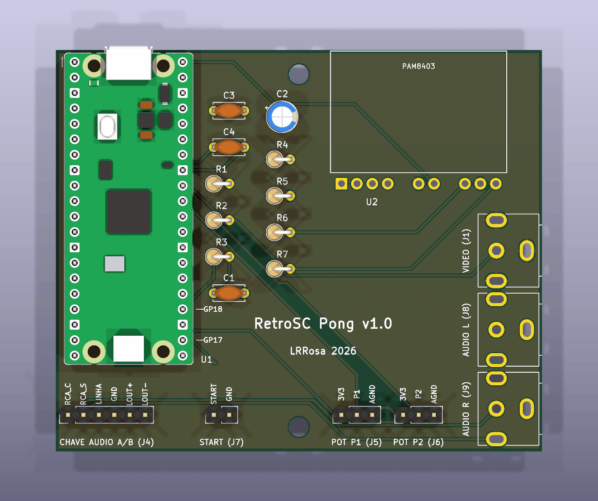
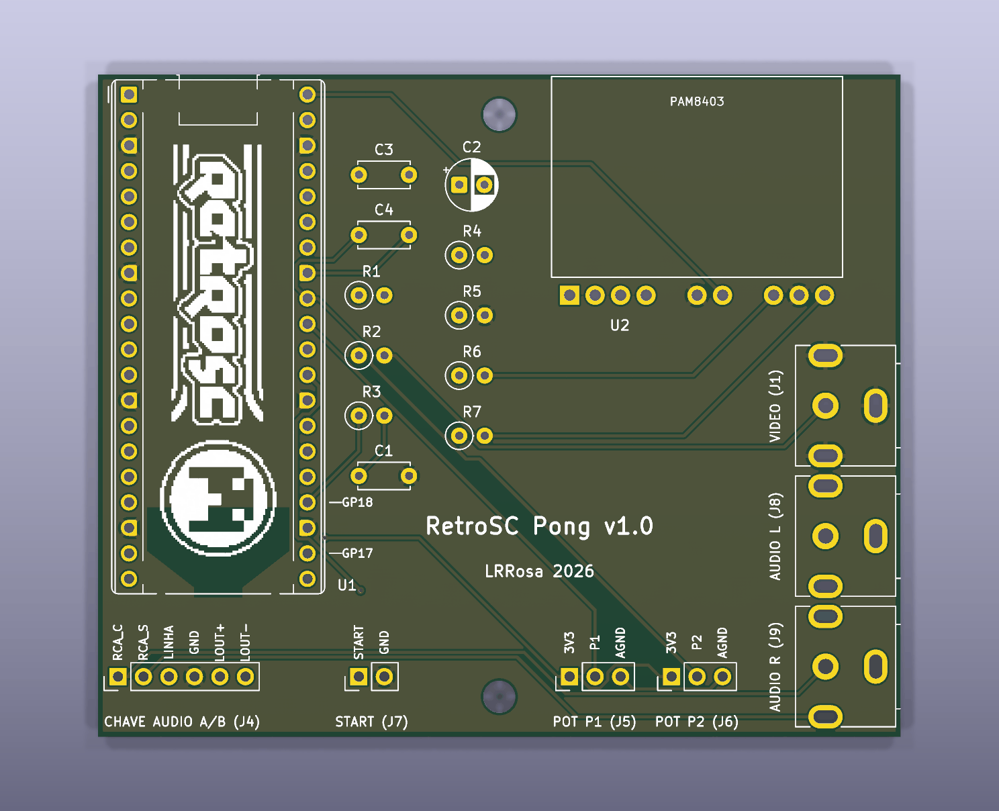
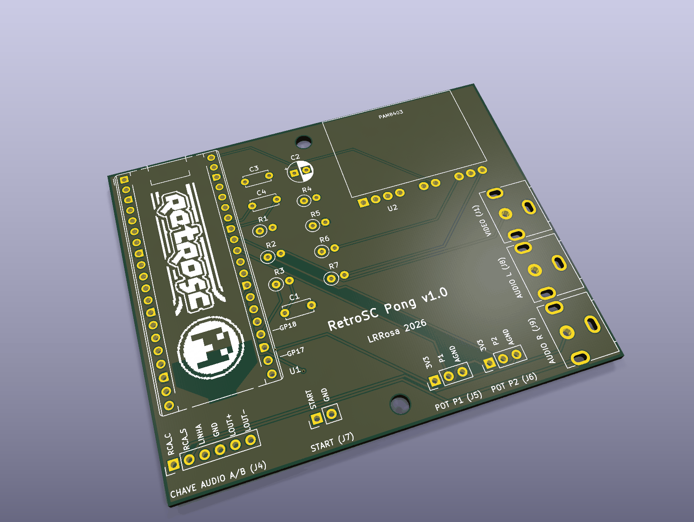
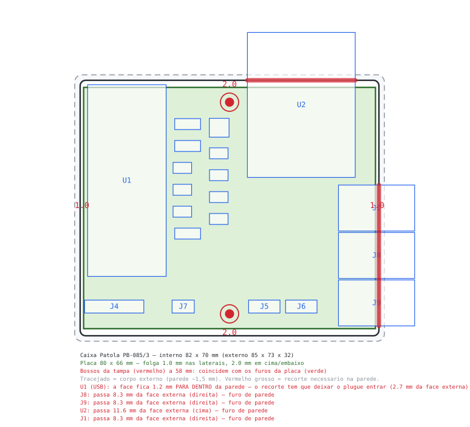

# PCB — RetroSC Pong

Placa de 2 camadas com plano de terra, gerada por scripts (reprodutível) e
roteada com o Freerouting. Hardware sob **CERN-OHL-S-2.0** (ver
[`../LICENSE-HARDWARE.txt`](../LICENSE-HARDWARE.txt)).

| Montada | Sem componentes (serigrafia à mostra) |
| :---: | :---: |
|  |  |



**80 × 66 mm**, imagens da variante oficial (a YD é idêntica por fora; muda só
o roteamento). O logo RetroSC fica **embaixo do Pico** — por isso aparece na
serigrafia e não no render 3D. Layout detalhado em [Estado](#estado).

> O **Pico é o único componente com modelo 3D** (os footprints próprios do RCA
> e do PAM8403 não têm) — e é justamente ele que cobre o logo. Por isso a
> segunda vista é renderizada **sem componentes**: é nela que se confere a
> serigrafia. As três saem do passo 8 do pipeline.

**Duas variantes**, escolhidas pelo módulo RP2040 que você tem (mesma
furação, pinagens diferentes — ver [../docs/pinout.md](../docs/pinout.md) e
as marcas GP17/GP18 no silk):

| Variante | Módulo | Arquivos |
| --- | --- | --- |
| oficial | Raspberry Pi Pico **ou** YD-RP2040 de **3 botões** (pinagem ≈ Pico) | `retrosc-pong.*`, `gerbers/`, `retrosc-pong-gerbers.zip` |
| YD | RP2040 **roxa de 1 botão** (USB-C, 16 MB) | `retrosc-pong-yd.*`, `gerbers-yd/`, `retrosc-pong-yd-gerbers.zip` |

> Atenção: existem clones parecidos com pinagens diferentes entre si. O que
> define a variante é a **pinagem**, não a cor/marca — na dúvida, confira a
> tabela completa em `docs/pinout.md` e as marcas GP17/GP18.

## Como fabricar (é só isto)

1. Escolha a variante pela tabela acima — **qual módulo RP2040 você tem**.
2. Baixe o ZIP correspondente (`retrosc-pong-gerbers.zip` ou
   `retrosc-pong-yd-gerbers.zip`) e envie **como está** para a fábrica
   (JLCPCB, PCBWay, Elecrow…).
3. Parâmetros: **2 camadas, 1,6 mm, HASL**, 80 × 66 mm. Os defaults de
   qualquer fábrica servem — não há nada exótico na placa.
4. Peças e montagem: [../docs/bom.md](../docs/bom.md).

Não é preciso instalar KiCad nem rodar nada. O pipeline abaixo só interessa
para **modificar** o projeto.

## Arquivos versionados

| Arquivo | O quê |
| --- | --- |
| `retrosc-pong[-yd].kicad_sch` / `.kicad_pro` | esquemático e projeto |
| `retrosc-pong[-yd].kicad_pcb` | **placa roteada** (DRC 0 erros) |
| `retrosc-pong.pretty/` | footprints próprios (RCA de painel, PAM8403 HW-012) |
| `fp-lib-table` | registra a lib de footprints do projeto |
| `gerbers[-yd]/` | Gerbers + furação (Excellon) prontos para fábrica |
| `retrosc-pong[-yd]-gerbers.zip` | os mesmos gerbers zipados — **baixe e envie direto à fábrica** |
| `../docs/retrosc-pong[-yd]-esquematico.pdf` | esquemático completo em 1 folha (para montar/conferir) |

Intermediários (`*-decoy.*`, `*.dsn`, `*.ses`, `*.net`) são **gitignored** —
regeráveis pelo pipeline abaixo.

## Pipeline (do zero à placa roteada) — só para modificar

Esta seção é para quem vai **alterar** a placa: tudo é gerado por script, então
não se edita o `.kicad_pcb` à mão — muda-se o gerador e roda-se o pipeline de
novo. Requer o **Python do KiCad** (`.../KiCad/10.0/bin/python.exe`, módulo `pcbnew`),
`kicad-cli` e o **Freerouting** instalado.

```sh
KPY="/c/Program Files/KiCad/10.0/bin/python.exe"
CLI="/c/Program Files/KiCad/10.0/bin/kicad-cli.exe"
FR="$LOCALAPPDATA/freerouting/freerouting.exe"

# 1. esquemático -> netlist  (roda no Python normal)
python tools/gen_kicad_sch.py
python tools/gen_kicad_fp.py
"$CLI" sch export netlist -o kicad/retrosc-pong.net kicad/retrosc-pong.kicad_sch

# 2. placa (placement, contorno, zonas, regras)   [Python do KiCad]
"$KPY" tools/gen_kicad_pcb.py

# 3. ISCA sem zonas + DSN                          [Python do KiCad]
"$KPY" tools/make_decoy.py

# 4. roteamento automatico  (caminhos relativos: sem espacos)
"$FR" -de kicad/retrosc-pong-decoy.dsn -do kicad/retrosc-pong-decoy.ses -mp 100 -da

# 5. importar SES na placa real + remover trilhas de GND  [Python do KiCad]
"$KPY" tools/import_ses.py

# 6. preencher o plano e validar
"$CLI" pcb drc --refill-zones --save-board --severity-error \
       --exit-code-violations kicad/retrosc-pong.kicad_pcb

# 7. gerbers + furacao + zip para a fabrica
"$CLI" pcb export gerbers --layers "F.Cu,B.Cu,F.SilkS,B.SilkS,F.Mask,B.Mask,Edge.Cuts" \
       --subtract-soldermask -o kicad/gerbers/ kicad/retrosc-pong.kicad_pcb
"$CLI" pcb export drill --format excellon --drill-origin absolute \
       --excellon-units mm --generate-map --map-format gerberx2 \
       -o kicad/gerbers/ kicad/retrosc-pong.kicad_pcb
powershell -c "Compress-Archive -Path kicad\gerbers\* -DestinationPath kicad\retrosc-pong-gerbers.zip -Force"

# 8. imagens do README (montada, sem componentes, isometrica)
"$KPY" tools/render_placa.py

# 9. esquemático em PDF/SVG (o que se usa para montar e conferir)
"$CLI" sch export pdf -o docs/retrosc-pong-esquematico.pdf kicad/retrosc-pong.kicad_sch
"$CLI" sch export svg --no-background-color -o docs/images/kicad/ kicad/retrosc-pong.kicad_sch
# 10. desenho de encaixe na caixa            [Python do KiCad]
"$KPY" tools/fit_caixa.py
```

**Variante YD-RP2040:** repita os passos com `--yd` nos scripts Python e o
sufixo `-yd` nos nomes de arquivo (`retrosc-pong-yd.*`, `gerbers-yd/`). Entre
os passos 3 e 4, afine a trilha de sinal para 0,25 mm (com 0,30 mm o net
SELETOR não fecha nessa variante) e peça **0,17 mm de isolamento** ao roteador
— pedindo os 0,15 do projeto ele entrega 0,1478 e o DRC reprova:

```sh
python tools/dsn_tweak.py kicad/retrosc-pong-yd-decoy.dsn 250 500 170
```

**Por que a isca (passo 3):** com as zonas presentes, o DSN as exporta como
*planes* que o Freerouting trata como obstáculo — ele vira quase mono-camada e
abandona os nets longos. Sem zonas, roteia livre nas 2 faces; o plano de GND
volta na placa real e absorve todo o GND (passo 5 remove as trilhas de GND
redundantes).

## Estado

- **Placa 80 × 66 mm**, dimensionada para a caixa **Patola PB-085/3**
  (85 × 73 × 32 mm; interno ~82 × 70). Pico à esquerda com o USB na borda de
  cima; PAM8403 no topo à direita, corpo na placa e pot de volume saindo pela
  mesma borda; os 3 RCAs na borda direita com o **barril protraindo ~10 mm**
  (atravessa a parede da caixa); headers de painel em **uma fileira** na borda
  de baixo, cada pino com a função na serigrafia.
- **Nada de trilha sob os parafusos:** cada furo leva uma **área de exclusão
  de raio 3,6 mm** (rule area nas 2 faces) que barra trilhas e vias — sem
  ela o roteador passava sinal a 2 mm do centro, ou seja, 0,4 mm da borda do
  furo, bem debaixo da cabeça do parafuso. O plano de GND continua entrando
  (encostar em GND é inofensivo). `make_decoy.py` **preserva** essas áreas ao
  montar a isca, senão o roteador não as enxergaria.
- **Furos de montagem: 2, a 58 mm entre centros**, na linha de centro da
  largura — H1 (40, 4) e H2 (40, 62). É a furação dos **bossos da tampa** da
  PB-085/3 (2 bossos com furo-guia ø2,5, a 58 mm, no centro do lado de
  85 mm). Em troca, o miolo das bordas de cima e de baixo (x 36,5..43,5)
  fica reservado — nenhum componente pode ocupá-lo.
- **J5 + J6 (pots)** ficam na mesma fileira com **uma posição vaga** entre
  eles: um único conector fêmea 1×7 (2,54 mm) serve os dois, deixando o
  contato do meio sem uso. Por isso o par é indivisível — e, como não cabia
  junto do J4 sem os rótulos se embaralharem, a ordem na borda de baixo é
  **J4 · J7 · (J5 J6)**: o SELETOR (serigrafado START na v1), que é independente, ficou à esquerda e o
  par dos pots à direita do furo de montagem.
- **Encaixe na caixa** (desenho em escala abaixo): folga de **1,0 mm** nas
  laterais e **2,0 mm** em cima/embaixo; os 2 furos caem exatamente sobre os
  bossos da tampa. Recortes necessários na parede: **3 RCAs à direita**
  (barril passa 8,3 mm da face externa), **pot do amp em cima** (11,6 mm) e
  **USB em cima** — este último *não* protrai: a face do conector fica 1,2 mm
  para dentro, então o recorte precisa deixar o plugue entrar.



  > O desenho sai de `tools/fit_caixa.py`, que lê a geometria da própria
  > placa — refaça-o a cada mudança de layout. **A altura** (26 mm internos)
  > não está no desenho: confira na peça real, principalmente o eixo do pot e
  > os barris dos RCAs, cuja altura depende de quanto o parafuso afasta a
  > placa dos bossos.
- **Logo RetroSC no silk da frente**, dentro do espaço do Pico (48,4 ×
  15,2 mm a 0,22 mm/pixel, entre as duas fileiras de pinos — fica visível
  antes da montagem ou com o Pico socketado). Gerado de
  `docs/images/logo_retrosc_1bit.png` com preto/branco invertidos (o traço
  do logo é a tinta). O logo é marca do evento e **não** é coberto pelas
  licenças do projeto.
- **Marcas GP17/GP18 no silk** ao lado dos furos correspondentes de cada
  variante (Pico: coluna direita, posições 22/24; YD-RP2040: cantos da base,
  posições 20/21). Antes de soldar, confira se elas batem com os rótulos do
  seu módulo — é o jeito rápido de ver se a placa e o módulo são da mesma
  variante.
- **Serigrafia:** rótulos de função por pino, nome + referência em cada
  header (ex.: `POT P1 (J5)`), marcas GP17/GP18 **com linha de chamada** até
  o pino exato, e os nomes dos RCAs **na vertical**, encostados em cada jack
  (assim acompanham a altura do conector e não invadem a faixa dos headers).
  No meio da placa fica a assinatura `RetroSC Pong v1.0` + `LRRosa 2026`. As referências que
  caíam sobre pads (J*, H*) foram ocultadas — a informação está nos rótulos
  descritivos. O logo foi reescalado (0,19 mm/px) para caber **entre** as
  duas linhas verticais do footprint do Pico.
- **DRC: 0 erros**, 0 silk sobre cobre e 0 sobreposições. Restam 12 avisos
  de `silk_edge_clearance`: são o desenho do USB e dos barris dos RCAs
  cruzando a borda — intencional, é por ali que eles saem da caixa.
- Regras: trilha de sinal 0,3 mm, isolamento 0,15 mm, via 0,7/0,35 mm (JLCPCB
  2 camadas).

## ATENÇÃO antes de fabricar

- **Footprints do RCA e do PAM8403 foram feitos à mão** a partir de medidas das
  peças. Confira o encaixe (imprima o **desenho de fabricação** em 1:1 e
  sobreponha as peças) antes de enviar para produção.
- Peças de **painel** (pots, botão, chave A/B) saem por headers (J4–J7); os RCAs
  e o amp ficam **na placa**, como no protótipo.
