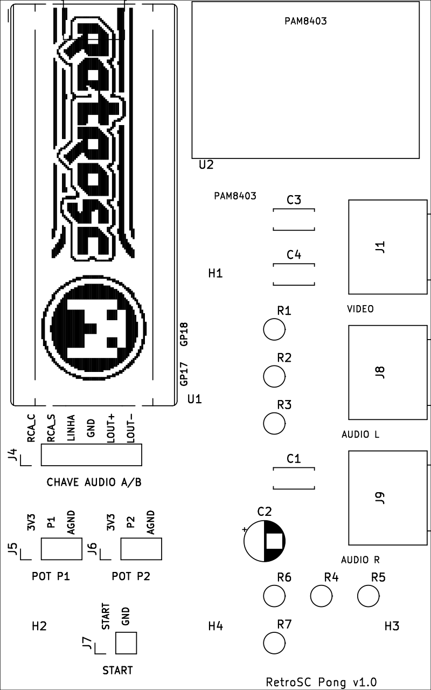

# PCB — RetroSC Pong

Placa de 2 camadas com plano de terra, gerada por scripts (reprodutível) e
roteada com o Freerouting. Hardware sob **CERN-OHL-S-2.0** (ver
[`../LICENSE-HARDWARE.txt`](../LICENSE-HARDWARE.txt)).

| Vista 3D (frente) | Serigrafia (frente) |
| :---: | :---: |
|  |  |

**55 × 88 mm**, imagens da variante oficial (a YD é idêntica por fora; muda só
o roteamento). O logo RetroSC fica **embaixo do Pico** — por isso aparece na
serigrafia e não no render 3D. Layout detalhado em [Estado](#estado).

> No render 3D o **Pico é o único componente com modelo 3D**; os jacks RCA e o
> módulo do amp são footprints próprios (sem modelo 3D) e aparecem só pelo
> contorno da serigrafia. Ambas as imagens saem do passo 8 do pipeline.

**Duas variantes**, escolhidas pelo módulo RP2040 que você tem (mesma
furação, pinagens diferentes — ver [../docs/pinout.md](../docs/pinout.md) e
as marcas GP17/GP18 no silk):

| Variante | Módulo | Arquivos |
| --- | --- | --- |
| oficial | Raspberry Pi Pico **ou** YD-RP2040 de **3 botões** (pinagem ≈ Pico) | `pong-retrosc.*`, `gerbers/`, `pong-retrosc-gerbers.zip` |
| YD | RP2040 **roxa de 1 botão** (USB-C, 16 MB) | `pong-retrosc-yd.*`, `gerbers-yd/`, `pong-retrosc-yd-gerbers.zip` |

> Atenção: existem clones parecidos com pinagens diferentes entre si. O que
> define a variante é a **pinagem**, não a cor/marca — na dúvida, confira a
> tabela completa em `docs/pinout.md` e as marcas GP17/GP18.

## Arquivos versionados

| Arquivo | O quê |
| --- | --- |
| `pong-retrosc[-yd].kicad_sch` / `.kicad_pro` | esquemático e projeto |
| `pong-retrosc[-yd].kicad_pcb` | **placa roteada** (DRC 0 erros) |
| `pong-retrosc.pretty/` | footprints próprios (RCA de painel, PAM8403 HW-012) |
| `fp-lib-table` | registra a lib de footprints do projeto |
| `gerbers[-yd]/` | Gerbers + furação (Excellon) prontos para fábrica |
| `pong-retrosc[-yd]-gerbers.zip` | os mesmos gerbers zipados — **baixe e envie direto à fábrica** |

Intermediários (`*-decoy.*`, `*.dsn`, `*.ses`, `*.net`) são **gitignored** —
regeráveis pelo pipeline abaixo.

## Pipeline (do zero à placa roteada)

Requer o **Python do KiCad** (`.../KiCad/10.0/bin/python.exe`, módulo `pcbnew`),
`kicad-cli` e o **Freerouting** instalado.

```sh
KPY="/c/Program Files/KiCad/10.0/bin/python.exe"
CLI="/c/Program Files/KiCad/10.0/bin/kicad-cli.exe"
FR="$LOCALAPPDATA/freerouting/freerouting.exe"

# 1. esquemático -> netlist  (roda no Python normal)
python tools/gen_kicad_sch.py
python tools/gen_kicad_fp.py
"$CLI" sch export netlist -o kicad/pong-retrosc.net kicad/pong-retrosc.kicad_sch

# 2. placa (placement, contorno, zonas, regras)   [Python do KiCad]
"$KPY" tools/gen_kicad_pcb.py

# 3. ISCA sem zonas + DSN                          [Python do KiCad]
"$KPY" tools/make_decoy.py

# 4. roteamento automatico  (caminhos relativos: sem espacos)
"$FR" -de kicad/pong-retrosc-decoy.dsn -do kicad/pong-retrosc-decoy.ses -mp 100 -da

# 5. importar SES na placa real + remover trilhas de GND  [Python do KiCad]
"$KPY" tools/import_ses.py

# 6. preencher o plano e validar
"$CLI" pcb drc --refill-zones --save-board --severity-error \
       --exit-code-violations kicad/pong-retrosc.kicad_pcb

# 7. gerbers + furacao + zip para a fabrica
"$CLI" pcb export gerbers --layers "F.Cu,B.Cu,F.SilkS,B.SilkS,F.Mask,B.Mask,Edge.Cuts" \
       --subtract-soldermask -o kicad/gerbers/ kicad/pong-retrosc.kicad_pcb
"$CLI" pcb export drill --format excellon --drill-origin absolute \
       --excellon-units mm --generate-map --map-format gerberx2 \
       -o kicad/gerbers/ kicad/pong-retrosc.kicad_pcb
powershell -c "Compress-Archive -Path kicad\gerbers\* -DestinationPath kicad\pong-retrosc-gerbers.zip -Force"

# 8. imagens do README (render 3D + serigrafia)
"$CLI" pcb render --side top --width 1100 --height 1700 --quality high \
       --background opaque -o docs/images/pcb_top.png kicad/pong-retrosc.kicad_pcb
"$CLI" pcb export svg --layers "F.SilkS,Edge.Cuts" --page-size-mode 2 \
       --exclude-drawing-sheet --black-and-white -o /tmp/silk.svg \
       kicad/pong-retrosc.kicad_pcb
inkscape /tmp/silk.svg --export-type=png --export-width=800 \
       --export-background=white --export-filename=docs/images/pcb_silk.png
```

**Variante YD-RP2040:** repita os passos com `--yd` nos scripts Python e o
sufixo `-yd` nos nomes de arquivo (`pong-retrosc-yd.*`, `gerbers-yd/`). Entre
os passos 3 e 4, afine a trilha de sinal para 0,25 mm — com 0,30 mm o net
START não fecha nessa variante:

```sh
python tools/dsn_tweak.py kicad/pong-retrosc-yd-decoy.dsn 250 500 150
```

**Por que a isca (passo 3):** com as zonas presentes, o DSN as exporta como
*planes* que o Freerouting trata como obstáculo — ele vira quase mono-camada e
abandona os nets longos. Sem zonas, roteia livre nas 2 faces; o plano de GND
volta na placa real e absorve todo o GND (passo 5 remove as trilhas de GND
redundantes).

## Estado

- **Placa 55 × 88 mm**, retrato: Pico com USB na borda superior; PAM8403 ao
  lado, corpo na placa e pot de volume saindo pela mesma borda; RCAs na borda
  direita com o **barril protraindo ~8,5 mm para fora** (o cabo pluga de fora);
  headers de painel empilhados à esquerda, cada um com o nome e a função de
  cada pino na serigrafia.
- **Furos de montagem M3** com passo de **45 mm**: base em y84 com H2 (5, 84),
  H4 (27,5, 84) e H3 (50, 84) — H2↔H3 = 45 mm, H4 no centro — e H1 (27,5, 39)
  no eixo X, 45 mm acima de H4. Um retângulo de 4 furos nos cantos não fecha
  nesta placa (os cantos superiores são do Pico e do RCA de vídeo).
- **J5 + J6 (pots)** ficam na mesma fileira com **uma posição vaga** entre
  eles: um único conector fêmea 1×7 (2,54 mm) serve os dois, deixando o
  contato do meio sem uso.
- **Logo RetroSC no silk da frente**, dentro do espaço do Pico (48,4 ×
  15,2 mm a 0,22 mm/pixel, entre as duas fileiras de pinos — fica visível
  antes da montagem ou com o Pico socketado). Gerado de
  `docs/images/logo_retrosc_1bit.png` com preto/branco invertidos (o traço
  do logo é a tinta). O logo é marca do evento e **não** é coberto pelas
  licenças do projeto.
- **Marcas GP17/GP18 no silk** ao lado dos furos correspondentes de cada
  variante (Pico: coluna direita, posições 22/24; YD-RP2040: cantos da base,
  posições 20/21). Antes de soldar, confira se elas batem com os rótulos do
  seu módulo — é o jeito rápido de ver se a placa e o módulo são da mesma
  variante.
- **DRC: 0 erros.** Restam avisos de silk (desenho do barril/USB atravessa a
  borda; referências sobre furos) — cosméticos, não bloqueiam a fabricação.
- Regras: trilha de sinal 0,3 mm, isolamento 0,15 mm, via 0,7/0,35 mm (JLCPCB
  2 camadas).

## ATENÇÃO antes de fabricar

- **Footprints do RCA e do PAM8403 foram feitos à mão** a partir de medidas das
  peças. Confira o encaixe (imprima o PDF de fabricação em 1:1 e sobreponha as
  peças) antes de enviar para produção.
- Peças de **painel** (pots, botão, chave A/B) saem por headers (J4–J7); os RCAs
  e o amp ficam **na placa**, como no protótipo.
